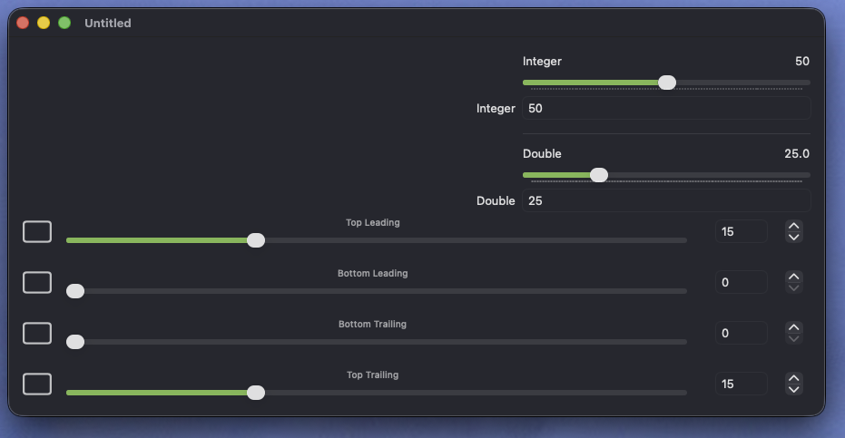
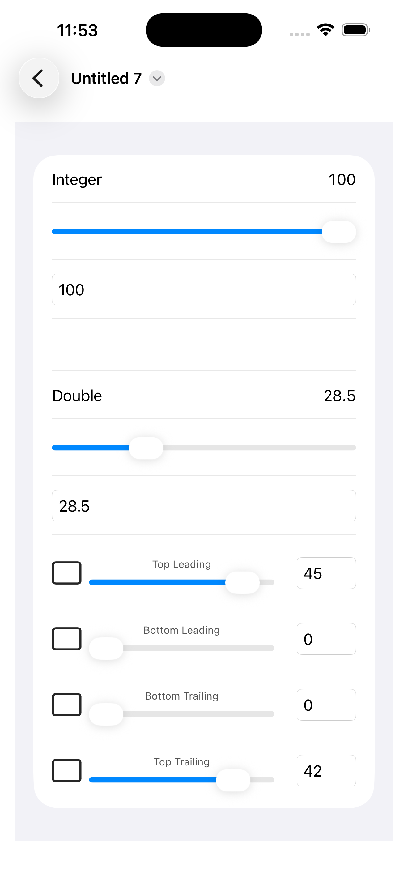

## Background

Managing document settings is quite varied across major productivity apps, and most of the
sample code I've found is lacking the kinds of details that matter for a shipping app.

The goal of this repo is to provide a better starting point for a variety of setting types,
including combo controls for integers, floats, and angles, as well as toggles for booleans.

We've also made sure the code is "universal" for various Apple platforms, including
macOS, iOS, and iPadOS, such that the application-level code abstracts away most of those details.

## The Sample App

SettingsDocApp is a sample app to demonstrate the use of `SettingViewStackView`, which
enables declaratively composing a settings page from a set of known models with automatic layout
and presentation of any of the supported types on the supported platforms:

    
    

## Benefits

In the `ContentView`, compare the implementation of the UI and settings for `IntValue` and `DoubleValue`
with the UI and settings provided by `LeafCapsuleSettings` and `LeafCapsuleSettingsView`.

## Roadmap

Here are the next steps for this repo:

1. Custom undoable actions that appear with custom Undo and Redo command names in the Edit menu.

This is one of the areas where I've found significant variations across apps shipped by developers
big and small. The various DocumentSetting scalar types provide both tracking and commit closures to
enable a clean implementation of undo groups with named undoable actions, so that's my next priority.

2. DocumentSettings should be its own Swift package.
